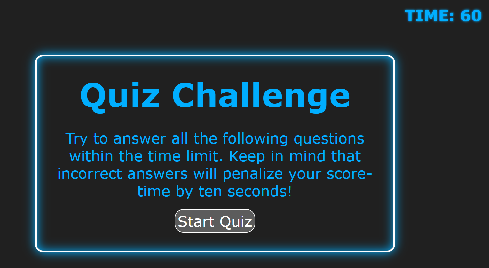

# Web APIs: Code Quiz

## Table of Contents 
- [Instructions](#Instructions)
- [Usage](#usage)
- [Credits](#credits)
- [Deployed application](#Deployed-application)

## Instructions

Try to answer all the following questions within the time limit. Keep in mind that incorrect answers will penalize your score-time by ten seconds!

## Usage

```
GIVEN I am taking a code quiz
WHEN I click the start button
THEN a timer starts and I am presented with a question
WHEN I answer a question
THEN I am presented with another question
WHEN I answer a question incorrectly
THEN time is subtracted from the clock
WHEN all questions are answered or the timer reaches 0
THEN the game is over
WHEN the game is over
THEN I can save my initials and my score
```

## Credits
This project was posbile with the knowledge acquired in Tecnologico de Monterrey University Coding Bootcamp https://bootcamp.tec.mx/coding/ 

## Deployed application

https://stamm2911.github.io/Web-APIs-Quiz/
